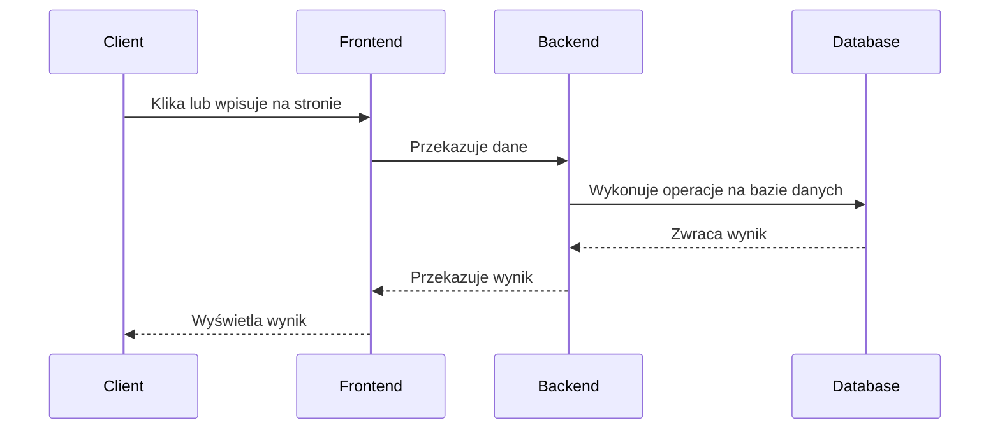
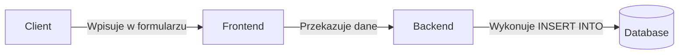
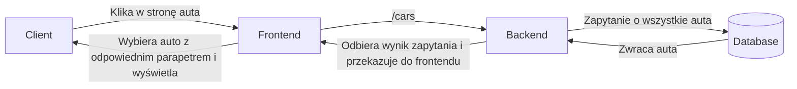
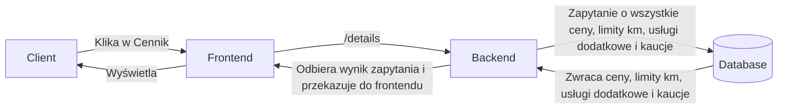

# <center>Fast Cars</center>
#### <center> autor Kacper Czykierda</center>

## Cel projektu
Strona wypożyczalni samochodowej pozwalająca na przejrzenie oferty oraz dodanie nowych aut do bazy danych będąca projektem zaliczeniowym z przedmiotu Projektowanie Aplikacji Internetowych w roku akademickim 2023/2024

### Jak uruchomić
1. Sklonuj repozytorium
```
    git clone https://github.com/Czykii/Projektowanie-aplikacji-internetowych-2023-2024
```
2. Zainstaluj pakiety NPM
```
    npm install
```
3. Uruchom backend
```
    cd backend
    npm start
```
4. Uruchom frontend
```
    cd frontend
    npm start
```

### Mockup

#### Link do mockupów znajduje się [tutaj](https://app.moqups.com/Z2eXQDFv2ZOIB5rI0rLLCp5XEibbQZS4/view/page/ad64222d5). Stworzone za pomoca witryny [Moqups.com](https://moqups.com/).

####  Technologie:
* NodeJS / Express
* React
* REST
* MySQL
* SequelizeJS
* CSS
* HTML5
* JS

### Model architektury

Monolit - zawiera wszystkie cechy i funkcje w jednej aplikacji i jednej bazie kodu. One mogą zostać zainstalowane w tym samym czasie, wtedy każdy serwer będzie hostem dla kompletnej kopii tej aplikacji.

### Diagramy przepływu danych

#### Generalny przepływ danych w aplikacji:



##### Funkcjonalność: Dodanie auta/dodatkowej usługi



##### Funkcjonalność: Wyświetlenie aut



##### Funkcjonalność: Wyświetlenie cennika



### Rest API

#### Pobranie listy aut

GET /cars

##### Przykładowa odpowiedź

```json
[
	{
		"id": 1,
		"car": "Audi R8",
		"fuel": "Benzyna",
		"power": 620,
		"gearbox": 6,
		"seats": 2,
		"acceleration": 3,
		"limit": 150,
		"drive": "AWD",
		"createdAt": "2023-01-25T11:27:25.000Z",
		"updatedAt": "2023-01-25T11:27:25.000Z"
	},
	{
		"id": 2,
		"car": "Nissan GTR",
		"fuel": "Benzyna",
		"power": 570,
		"gearbox": 6,
		"seats": 4,
		"acceleration": 2.7,
		"limit": 250,
		"drive": "AWD",
		"createdAt": "2023-01-25T11:27:49.000Z",
		"updatedAt": "2023-01-25T11:27:49.000Z"
	},
	{
		"id": 3,
		"car": "Porsche 911",
		"fuel": "Benzyna",
		"power": 580,
		"gearbox": 6,
		"seats": 4,
		"acceleration": 2.7,
		"limit": 200,
		"drive": "AWD",
		"createdAt": "2023-01-25T11:28:05.000Z",
		"updatedAt": "2023-01-25T11:28:05.000Z"
	}
]
```

#### Pobranie cen aut

GET /prices

##### Przykładowa odpowiedź

```json
[
	{
		"id": 1,
		"model_auta": "Audi R8",
		"cena_1": 900,
		"cena_7": 4500,
		"cena_30": 10000,
		"createdAt": "2023-02-06T15:09:52.000Z",
		"updatedAt": "2023-02-06T15:09:52.000Z"
	},
	{
		"id": 2,
		"model_auta": "Nissan GTR",
		"cena_1": 800,
		"cena_7": 4000,
		"cena_30": 9000,
		"createdAt": "2023-02-06T15:10:57.000Z",
		"updatedAt": "2023-02-06T15:10:57.000Z"
	},
	{
		"id": 3,
		"model_auta": "Porsche 911",
		"cena_1": 700,
		"cena_7": 3500,
		"cena_30": 8000,
		"createdAt": "2023-02-06T15:11:21.000Z",
		"updatedAt": "2023-02-06T15:11:21.000Z"
	}
]
```

#### Pobranie limitów kilometrów

GET /limits

##### Przykładowa odpowiedź

```json
[
	{
		"id": 1,
		"okres": "1-3 dni",
		"kilometry": 250,
		"createdAt": "2023-02-06T15:19:26.000Z",
		"updatedAt": "2023-02-06T15:19:26.000Z"
	},
	{
		"id": 2,
		"okres": "3-6 dni",
		"kilometry": 200,
		"createdAt": "2023-02-06T15:19:43.000Z",
		"updatedAt": "2023-02-06T15:19:43.000Z"
	},
	{
		"id": 3,
		"okres": "7-13 dni",
		"kilometry": 175,
		"createdAt": "2023-02-06T15:19:59.000Z",
		"updatedAt": "2023-02-06T15:19:59.000Z"
	},
	{
		"id": 4,
		"okres": "14-20 dni",
		"kilometry": 135,
		"createdAt": "2023-02-06T15:20:16.000Z",
		"updatedAt": "2023-02-06T15:20:16.000Z"
	},
	{
		"id": 5,
		"okres": "21-29 dni",
		"kilometry": 100,
		"createdAt": "2023-02-06T15:20:31.000Z",
		"updatedAt": "2023-02-06T15:20:31.000Z"
	},
	{
		"id": 6,
		"okres": "30 dni i więcej",
		"kilometry": 85,
		"createdAt": "2023-02-06T15:20:46.000Z",
		"updatedAt": "2023-02-06T15:20:46.000Z"
	}
]
```

#### Pobranie listy dodatkowych usług

GET /accs

##### Przykładowa odpowiedź

```json
[
	{
		"id": 1,
		"nazwa": "Obiór/Zwrot poza godzinami pracy",
		"cena": 150,
		"createdAt": "2023-02-06T15:21:23.000Z",
		"updatedAt": "2023-02-06T15:21:23.000Z"
	},
	{
		"id": 2,
		"nazwa": "Dopisanie drugiego kierowcy do umowy",
		"cena": 200,
		"createdAt": "2023-02-06T15:21:52.000Z",
		"updatedAt": "2023-02-06T15:21:52.000Z"
	},
	{
		"id": 3,
		"nazwa": "Dostawa auta do wybranego miejsca w Małopolsce",
		"cena": 1750,
		"createdAt": "2023-02-06T15:22:59.000Z",
		"updatedAt": "2023-02-06T15:22:59.000Z"
	},
	{
		"id": 4,
		"nazwa": "Dzienna opłata za nadprzebieg",
		"cena": 50,
		"createdAt": "2023-02-06T15:23:18.000Z",
		"updatedAt": "2023-02-06T15:23:18.000Z"
	},
	{
		"id": 5,
		"nazwa": "Poświęcenie auta w Wadowicach przed wynajmem",
		"cena": 2137,
		"createdAt": "2023-02-06T15:23:50.000Z",
		"updatedAt": "2023-02-06T15:23:50.000Z"
	}
]
```

#### Pobranie listy cen kaucji

GET /deps

##### Przykładowa odpowiedź

```json
[
	{
		"id": 1,
		"wiek": "18-21 lat",
		"cena": 4000,
		"createdAt": "2023-02-06T15:24:03.000Z",
		"updatedAt": "2023-02-06T15:24:03.000Z"
	},
	{
		"id": 2,
		"wiek": "21-24 lata",
		"cena": 2000,
		"createdAt": "2023-02-06T15:24:16.000Z",
		"updatedAt": "2023-02-06T15:24:16.000Z"
	},
	{
		"id": 3,
		"wiek": "powyżej 24 lat",
		"cena": 1000,
		"createdAt": "2023-02-06T15:24:29.000Z",
		"updatedAt": "2023-02-06T15:24:29.000Z"
	}
]
```